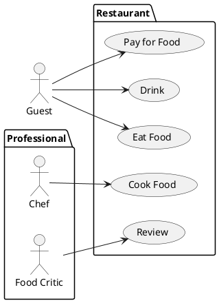
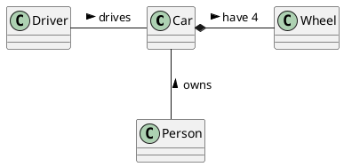

# Student information system - Subjects

System for managing subjects.

## Functional Requirements

This section specifies the functional requirements.

### User requirements

As a teacher I want to be able to send a request to create a subject. 
As a teacher I want to be able to set subject info. 
As a teacher I want to be able to activate a subject. 
As a teacher I want to be able to set co/pre-requisites. 
As a teacher I want to be able to set the teachers for a subject. 

As a SDO I want to be able to activate/deactivate a subject. 
As a SDO I want to be able to accept a subject creation request. 
As a SDO I want to be able to add a subject to a study programme. 

As a student I want to be able to view subject info. 
### System requirements

#### Actors

[*Document here all actors from the use case diagrams. Make a subsection for each actor and their short description in each subsection.*]

##### [*Actor name*]

[*Actor description*]

#### Use cases

[*Document here all use cases. Create a subsection for each use case diagram. If you have only one use case diagram, you do not need a special subsection.*]

##### [*Use case diagram title*]

[*Use case diagram in PlantUML*]

To be able to embed PlantUML diagrams to Markdown code with previews in VSCode you need
* Markdown All in One extension
* PlantUML extension
View > Command Pallete... > Markdown All in One: Print current document to HTML

Follow https://plantuml.com/

[*Describe the diagram in a short paragraph. Describe each use case from the diagram in the detail from the lecture in a separate subsection.*]

###### [*Use case title*]

[*Use case description in the structure from the lecture.*]

[*Add an activity diagram for one use case per a team member*]

## Information model

[*Express the information model of the domain as a UML class diagram in PlantUML. Do not use class methods in the diagram, only classes, class attributes and associations connecting classes.*]

[*Document each class with in a separate subsection*]

### [*Class name*]

[*Class description consisting of its definition, description of its essential properties (attribues and associations).*]
