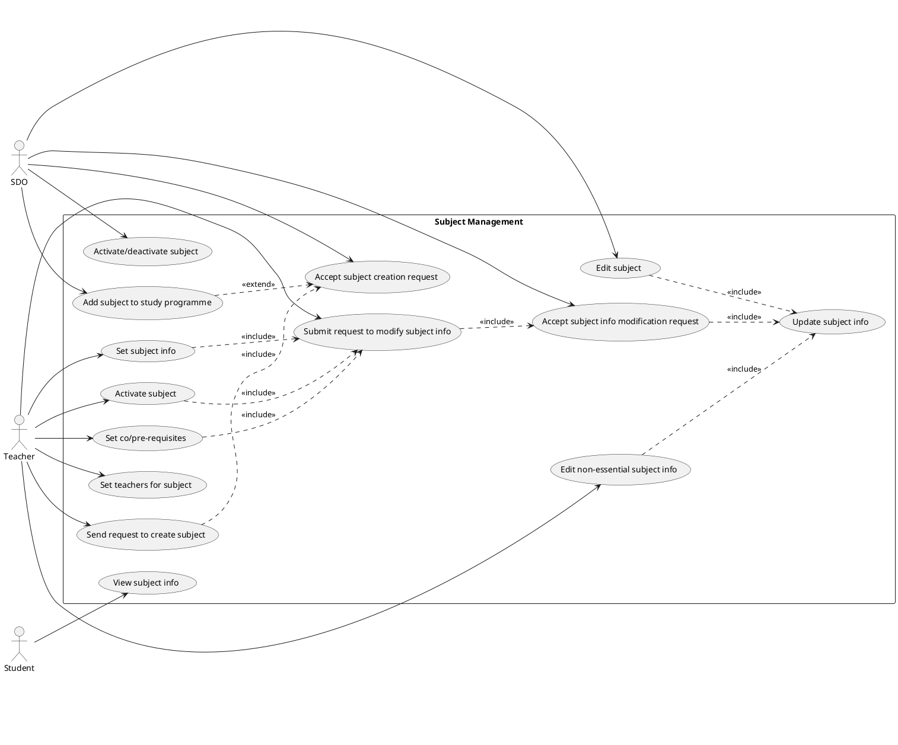
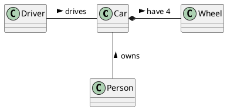

# Student information system - Subjects

System for managing subjects.

## Functional Requirements

This section specifies the functional requirements.

### User requirements

- As a teacher, I want to be able to send a request to create a subject so that new subjects can be created.
- As a teacher, I want to be able to set subject info because nobody else can it set.
- As a teacher I want to be able to activate a subject because it allows the subject to be available for enrollment, enabling students to register for the course.
- As a teacher, I want to be able to set co/pre-requisites because it ensures that students have the necessary foundation or concurrent knowledge required to succeed in the subject.
- As a teacher, I want to be able to set the teachers for a subject because it allows me to designate qualified instructors who can effectively deliver the subject material and provide guidance to students.
- As a teacher, I want to be able to submit a request to modify important information about the subject (instructor, credits, prerequisites, co-requisites, etc.) so that any necessary updates or changes can be accurately reflected in the system.
- As a teacher I want to be able to edit non-essential information about the subject (annotations, requirements for credit, literature, syllabus, etc.) without submitting a request, ensuring flexibility and efficiency in managing the subject details.
- As a SDO, I want to be able to activate/deactivate a subject because it enables me to control the availability of subjects within the curriculum, aligning with academic policies and ensuring efficient resource allocation.
- As a SDO, I want to be able to accept a subject creation request t because it allows me to review and approve proposals for new subjects, ensuring alignment with educational objectives and curricular standards.
- As a SDO, I want to be able to add a subject to a study programme because it enables me to incorporate approved subjects into the curriculum of specific study programs, ensuring that students have access to a structured and coherent course of study.
- As a SDO, I want to be able to edit subjects directly to correct mistakes and make edits efficiently, without relying on teachers to file requests for changes.
- As a student, I want to be able to view subject info because it provides me with essential details about subjects, such as course content, prerequisites, and instructors, helping me make informed decisions about my academic path and course selections.

### System requirements

#### Actors

##### Teacher

Faculty members responsible for initiating subject-related actions such as creating, modifying, and activating subjects, as well as assigning instructors and setting prerequisites.

##### SDO (Student department)

Administrative personnel tasked with managing subjects at a higher level, including activating/deactivating subjects, accepting subject creation requests, adding subjects to study programs, and editing subjects.

##### Student

Individuals who are enrolled in a study programme.

#### Use cases

##### Subject management

The use case diagram depicts the subject management system, involving three main actors: Teachers, Student Department Officers (SDO), and Students.
The Teacher actor interacts with various use cases such as sending requests to create subjects, setting subject info, activating subjects, submitting requests to modify subject info, and editing non-essential subject info.
The SDO actor is responsible for tasks like activating/deactivating subjects, accepting subject creation requests, adding subjects to study programs, and editing subjects.
Students interact with the system to view subject info.

###### [*Use case title*]

[*Use case description in the structure from the lecture.*]

[*Add an activity diagram for one use case per a team member*]

## Information model

[*Express the information model of the domain as a UML class diagram in PlantUML. Do not use class methods in the diagram, only classes, class attributes and associations connecting classes.*]

[*Document each class with in a separate subsection*]

### [*Class name*]

[*Class description consisting of its definition, description of its essential properties (attribues and associations).*]
