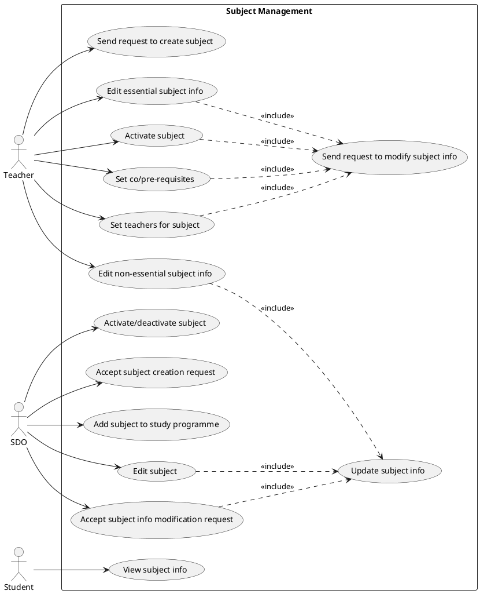
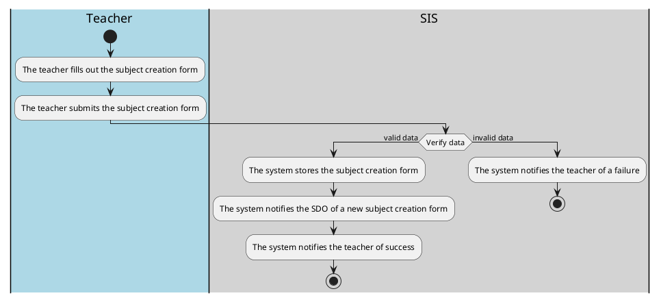
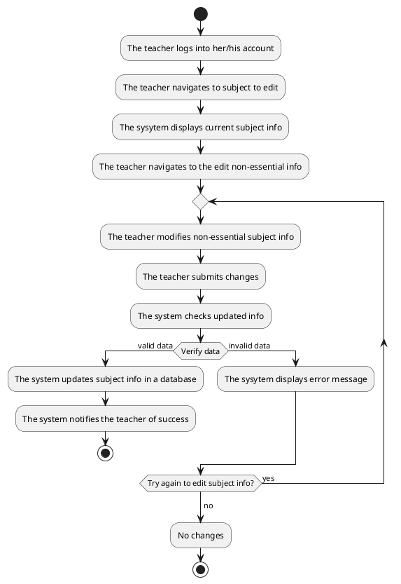
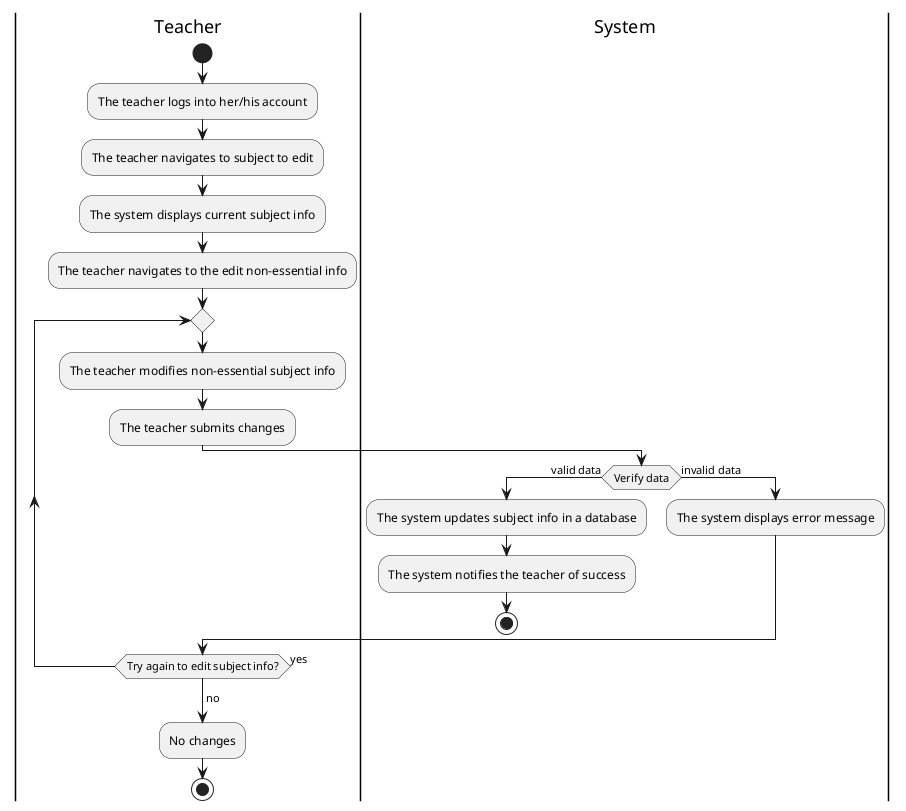
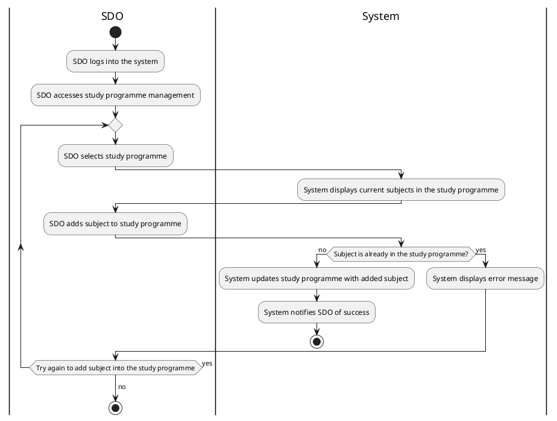
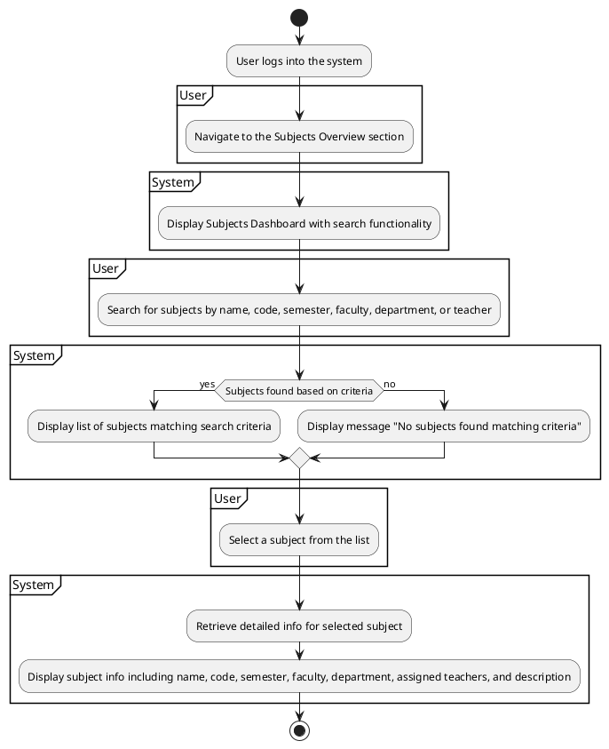
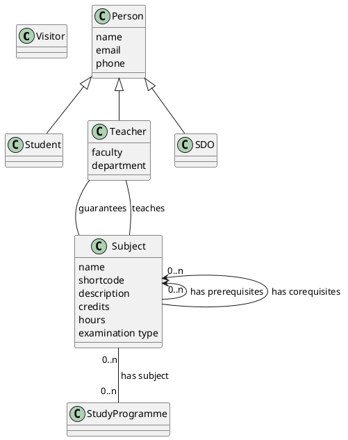

# Student information system - Subjects

System for managing subjects.

## Functional Requirements

This section specifies the functional requirements.

### User requirements

- As a teacher, I want to be able to send a request to create a subject so that new subjects can be created.
- As a teacher, I want to be able to set subject info because nobody else can it set.
- As a teacher I want to be able to activate a subject because it allows the subject to be available for enrollment, enabling students to register for the course.
- As a teacher, I want to be able to set co/pre-requisites because it ensures that students have the necessary foundation or concurrent knowledge required to succeed in the subject.
- As a teacher, I want to be able to set the teachers for a subject because it allows me to designate qualified instructors who can effectively deliver the subject material and provide guidance to students.
- As a teacher, I want to be able to submit a request to modify important information about the subject (instructor, credits, prerequisites, co-requisites, etc.) so that any necessary updates or changes can be accurately reflected in the system.
- As a teacher I want to be able to edit non-essential information about the subject (annotations, requirements for credit, literature, syllabus, etc.) without submitting a request, ensuring flexibility and efficiency in managing the subject details.

- As a SDO, I want to be able to activate/deactivate a subject because it enables me to control the availability of subjects within the curriculum, aligning with academic policies and ensuring efficient resource allocation.
- As a SDO, I want to be able to accept a subject creation request t because it allows me to review and approve proposals for new subjects, ensuring alignment with educational objectives and curricular standards.
- As a SDO, I want to be able to add a subject to a study programme because it enables me to incorporate approved subjects into the curriculum of specific study programs, ensuring that students have access to a structured and coherent course of study.
- As a SDO, I want to be able to edit subjects directly to correct mistakes and make edits efficiently, without relying on teachers to file requests for changes.

- As a student, I want to be able to view subject info because it provides me with essential details about subjects, such as course content, prerequisites, and instructors, helping me make informed decisions about my academic path and course selections.

### System requirements

#### Actors

##### Teacher

Faculty members responsible for initiating subject-related actions such as creating, modifying, and activating subjects, as well as assigning instructors and setting prerequisites.

##### SDO (Student department)

Administrative personnel tasked with managing subjects at a higher level, including activating/deactivating subjects, accepting subject creation requests, adding subjects to study programs, and editing subjects.

##### Student

Individuals who are enrolled in a study programme.

#### Use cases

##### Subject management

The use case diagram depicts the subject management system, involving three main actors: Teachers, Student Department Officers (SDO), and Students.
The Teacher actor interacts with various use cases such as sending requests to create subjects, setting subject info, activating subjects, submitting requests to modify subject info, and editing non-essential subject info.
The SDO actor is responsible for tasks like activating/deactivating subjects, accepting subject creation requests, adding subjects to study programs, and editing subjects.
Students interact with the system to view subject info.

###### Send request to create subject

This use case describes a process, by which the teacher can send a request to the study department office for creation of a new subject.

**Actors**

- Teacher
- SDO

**Precondition**
The teachers has logged in into their SIS account and have opened the form for creating a new subject.

**Normal**

1. The teacher fills out the subject creation form by setting all of the required fields in the subject creation form (also by setting some optional fields).
2. The teacher submits the subject creation form.
3. SIS verifies if the field values of the submitted form are valid (possible number of credits, examination type, supported languages, etc.)
4. SIS stores the form and sends the SDO a notification in regards to the new subject creation form
5. SIS notifies the teacher of a successful submission

**What can go wrong**

**System state on completion**

- A new valid subject creation request is recorded and available for an SDO officer to accept
- An invalid subject creation request is rejected and the teacher is notified of that fact.

##### Use Case: Edit essential subject info

###### Starting situation (Initial assumption)

- The teacher must be able to log in to the system
- The teacher has to be authorized to edit essential subject information.
- The subject must already exist in the system.

###### Normal

1. The teacher logs into their account.
2. The teacher navigates to subject they wish to edit essential subject info.
3. The system displays current subject information.
4. The teacher navigates to the edit non-essential info
5. The teacher modifies the fields they wish to change, such as the subject's name, code, credits, timetable, teachers ...
6. The teacher submits the changes.
7. The SDO approves the changes.
8. The system checks if updated information about subject is valid.
9. The system updates the subject information in the database.
10. The system notifies the SDO and the teacher that the update was successful.

###### What can go wrong

- If the SDO does not approve change that the teacher did, the error message is sent to the teacher and the teacher will decide if they want to try again to edit the subject information or to end editing without changing anything.
- If edited subject info is invalid, the system displays an error message and the SDO will decide if they want to fix error or to send error message to the teacher.

###### System state on completion

- Subject information are updated, the SDO and the teacher is notified about the successful completion.
- Non-approved subject information is rejected and the teacher is notified about the error and decide what they want to do the next.
- Non-valid information is rejected and the SDO will decide what to do the next. The SDO can send error message to the teacher and let them decide what do to like with non-approved information or the SDO can try to fix error.

##### Use Case: Edit non-essential subject info

###### Starting situation (Initial assumption)

- The teacher must be able to log in to the system
- The teacher has to be authorized to edit non-essential subject information.
- The subject must already exist in the system.

###### Normal

1. The teacher logs into their account.
2. The teacher navigates to subject they wish to edit non-essential subject info.
3. The system displays current subject information.
4. The teacher navigates to the edit essential info
5. The teacher modifies the fields they wish to change, such as the subject's description ...
6. The teacher submits the changes.
7. The system checks if updated information about subject is valid.
8. The system updates the subject information in the database.
9. The system notifies the teacher that the update was successful.

###### What can go wrong

- If the teacher enters invalid information, the system displays an error message and the teacher will decide if they want to try again to edit the subject information or to end editing without changing anything.

###### System state on completion

- Subject information are updated, the teacher is notified about the successful completion.
- Non-valid subject information is rejected and the teacher is notified about the error and decide what they want todo the next.

##### Use Case: Edit non-essential subject info

###### Starting situation (Initial assumption)

- The teacher must be able to log in to the system
- The teacher has to be authorized to edit non-essential subject information.
- The subject must already exist in the system.

###### Normal

1. The teacher logs into their account.
2. The teacher navigates to subject they wish to edit non-essential subject info.
3. The system displays current subject information.
4. The teacher navigates to the edit essential info
5. The teacher modifies the fields they wish to change, such as the subject's description ...
6. The teacher submits the changes.
7. The system checks if updated information about subject is valid.
8. The system updates the subject information in the database.
9. The system notifies the teacher that the update was successful.

###### What can go wrong

- If the teacher enters invalid information, the system displays an error message and the teacher will decide if they want to try again to edit the subject information or to end editing without changing anything.

###### System state on completion

- Subject information is updated, the teacher is notified about the successful completion.
- Non-valid subject information is rejected and the teacher is notified about the error and decide what they want to do the next.

##### Use Case: Edit essential subject info

###### Starting situation (Initial assumption)

- The teacher must be able to log in to the system
- The teacher has to be authorized to edit essential subject information.
- The subject must already exist in the system.

###### Normal

1. The teacher logs into their account.
2. The teacher navigates to subject they wish to edit essential subject info.
3. The system displays current subject information.
4. The teacher navigates to the edit non-essential info
5. The teacher modifies the fields they wish to change, such as the subject's name, code, credits, timetable, teachers ...
6. The teacher submits the changes.
7. The SDO approves the changes.
8. The system checks if updated information about subject is valid.
9. The system updates the subject information in the database.
10. The system notifies the SDO and the teacher that the update was successful.

###### What can go wrong

- If the SDO does not approve change that the teacher did, the error message is sent to the teacher and the teacher will decide if they want to try again to edit the subject information or to end editing without changing anything.
- If edited subject info is invalid, the system displays an error message and the SDO will decide if they want to fix error or to send error message to the teacher.

###### System state on completion

- Subject information is updated, the SDO and the teacher is notified about the successful completion.
- Non-approved subject information is rejected and the teacher is notified about the error and decide what they want to do the next.
- Non-valid information is rejected and the SDO will decide what to do the next. The SDO can send error message to the teacher and let them decide what do to like with non-approved information or the SDO can try to fix error.

##### Use Case: Edit subject

###### Starting situation (Initial assumption)

- The SDO must be able to log in to the system
- The SDO has to be authorized to edit subject information.
- The subject must already exist in the system.

###### Normal

1. The SDO logs into the system and accesses the subject management section.
2. The SDO selects the subject to edit.
3. The SDO modifies essential or non-essential fields they wish to change.
4. The SDO submits the changes.
5. The system checks if updated information about subject is valid.
6. The system updates the subject information in the database.
7. The system notifies the SDO that the update was successful.

###### What can go wrong

- If the SDO enters invalid information, the system displays an error message and the SDO will decide if they want to try again to edit the subject information or to end editing without changing anything.

###### System state on completion

- Subject information is updated, the SDO is notified about the successful completion.
- Non-valid subject information is rejected and the SDO is notified about the error and decide what they want to do the next.

##### Use Case: Set co/pre-requisites

###### Starting situation (Initial assumption)

- The teacher must be able to log in to the system
- The teacher has to be authorized to set co/pre-requisites for the specific subject.
- The subject must already exist in the system.

###### Normal

1. The teacher logs into their account.
2. The teacher navigates to the subject for which they want to set co/prerequisites.
3. The system displays the current co/prerequisites for the chosen subject.
4. The teacher adds/modifies the subject's co/prerequisites from a list of available subjects.
5. The teacher submits the changes.
6. The system checks if selected subjects are valid co/prerequisites.
7. The system updates the subject's co/prerequisites.
8. The system notifies the teacher that the co/prerequisites have been successfully set.

###### What can go wrong

- If the teacher selects a subject that cannot logically be set as a co/prerequisite, the system displays an error message and the teacher will decide if they want to choose a different subject as a co/prerequisite.

###### System state on completion

- The subject's co/prerequisites are set in the system and the teacher is notified about the successful completion.
- Students are informed of the updated requirements.
- Non-valid subject's co/prerequisite is rejected and the teacher is notified about the error.

##### Use Case: Add subject to study programme

###### Starting situation (Initial assumption)

- The SDO must be able to log in to the system.
- The SDO has to be authorized to add subjects to study programmes.
- The subject must already exist in the system.
- The study programme must already exist in the system.

###### Normal

1. The SDO logs into the system and accesses the study programme management section.
2. The SDO selects the study programme to which they want to add a subject.
3. The system displays the current list of subjects in the chosen study programme.
4. The SDO adds the subject to the study programme from a list of available subjects.
5. The SDO submits the changes.
6. The system checks if the selected subject is valid and not already part of the study programme.
7. The system updates the study programme with the added subject.
8. The system notifies the SDO that the subject has been successfully added to the study programme.

###### What can go wrong

- If the SDO selects a subject that is already part of the study programme, the system displays an error message, and the SDO will decide if they want to choose a different subject or cancel the operation.

###### System state on completion

- The subject is successfully added to the study programme, and the SDO is notified about the successful completion.
- Non-valid subjects are rejected, and the SDO is notified about the error.

#### Use Case Description: View Subject Info

**Title:** View Subject Info

**Primary Actors:** Student, Teacher, SDO

**Goal:** To allow users to view detailed information about a specific subject.

**Preconditions:**

- The user is logged into the system.
- The system contains up-to-date information on subjects.

**Main Flow:**

1. **User Login:** The user logs into the system and is authenticated.
2. **Navigate to Subjects Overview:** The user navigates to the "Subjects Overview" section or tab within the system interface.
3. **Display Subject Search Interface:** The system displays the "Subject Search" interface, which includes a search bar and possibly filters for criteria such as name, code, semester, faculty, department, or the names of teachers associated with subjects.
4. **Enter Search Criteria:** The user inputs search criteria into the search bar, which can include the subject name, code, semester, faculty, department, or teacher's name.
5. **Submit Search:** The user submits the search query.
6. **Display Search Results:** The system processes the search query and displays a list of subjects matching the search criteria. If no subjects are found, the system displays a "No subjects found" message.
7. **Select Subject:** The user selects a subject from the list to view more information.
8. **Retrieve and Display Subject Info:** The system retrieves detailed information about the selected subject from the database and displays it. This information includes the subject name, description, credit hours, semester, faculty, department, list of teachers, and schedule.

**Postconditions:**

- The user has accessed detailed information about the chosen subject.

**Alternative Flows:**

- **No Search Results:** If no subjects match the search criteria, the system displays a message indicating that no subjects were found. The user can adjust their search criteria and try again.

#### Use Case Description: Set Teachers for Subject

**Title:** Set Teachers for Subject

**Actor:** SDO

**Preconditions:**

- The SDO must be logged into the system with sufficient privileges.
- The subject and teacher information must be available in the system database.

**Main Flow:**

1. The SDO navigates to the subject management page.
2. The SDO selects the subject for which they want to assign teachers.
3. The system presents a list of available teachers.
4. The SDO selects one or more teachers to assign to the subject and confirms the selection.
5. The system updates the subject information with the assigned teacher(s) and displays a confirmation message.

**Postconditions:**

- The selected teacher(s) are assigned to the subject, and this information is updated in the system.

**Alternative Flows:**

- No Teachers Available: If there are no available teachers to assign, the system displays a message indicating this.

###### Send request to modify subject info

This use case describes a process, by which the teacher can send a request to the study department office for modification of essential subject info.

**Actors**

- Teacher
- SDO

**Precondition**
The teachers has logged in into their SIS account and have opened the form for modifying essential subject info.

**Normal**

**What can go wrong**

- The modification form contains some invalid values and the system notifies the teacher of a failed form submission.

**System state on completion**

- A new valid subject modification request is recorded and available for an SDO officer to accept, while notifying both the teacher and the SDO of the fact.
- An invalid subject modification request is rejected and the teacher is notified of that fact.

---

###### Activate/deactivate a subject

This use case describes a process, by which the SDO can activate/deactivate a subject.

**Actors**

- SDO

**Precondition**
The SDO has logged in to their SIS account and has opened the form for activating/deactivating a subject.

**Normal**

1. The SDO selects a subject by its shortcode and is provided with the option of activating/deactivating the subject.
2. The SDO clicks on the activate/deactivate subject button.
3. The application displays a verification window, to warn the SDO if they truly want to go proceed with the operation.
4. The SDO confirms the operation.
5. SIS verifies that the operation can be done, does it and notifies the SDO of it.

**What can go wrong**

- The subject activation/deactivation cannot be done(for example due to the subject being taught at the moment) and the SDO is notified of that.

**System state on completion**

- The subject is activated/deactivated and the SDO is notified of that.
- The subject activation/deactivation wasn't able to proceed and the SDO is notified of that.

## Information model

### Visitor

Non-logged in visitor to the website.

### Person

A natural person with personal information like name, email, phone etc.

### Student

A person studying at the university.

### Teacher

A person teaching at the university.

### SDO

A person working as a study department officer at the university.

### Subject

An area of knowledge or study being taught at the university.
