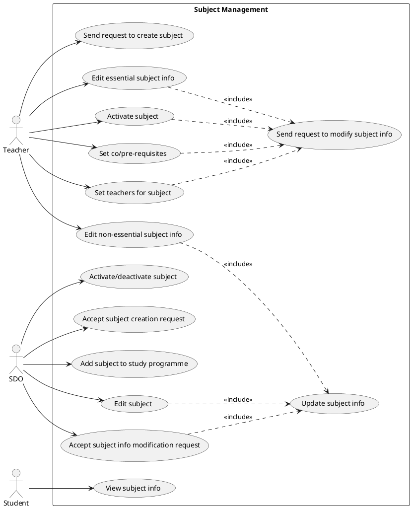
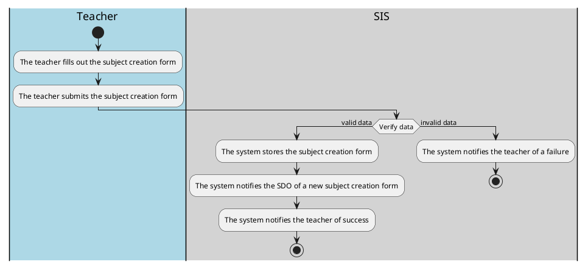
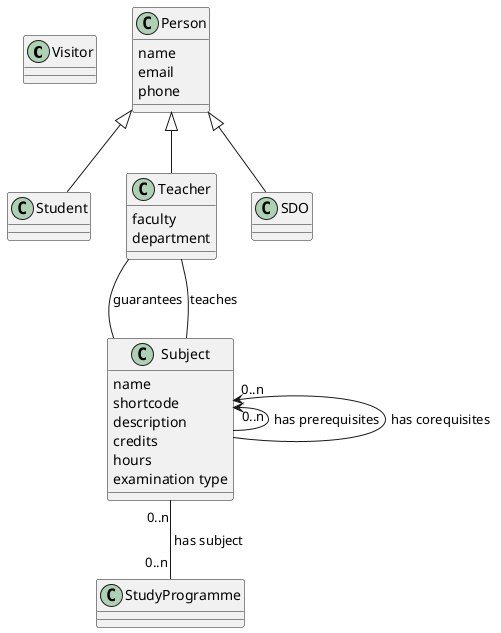

# Student information system - Subjects

System for managing subjects.

## Functional Requirements

This section specifies the functional requirements.

### User requirements

- As a teacher, I want to be able to send a request to create a subject so that new subjects can be created.
- As a teacher, I want to be able to set subject info because nobody else can it set.
- As a teacher I want to be able to activate a subject because it allows the subject to be available for enrollment, enabling students to register for the course.
- As a teacher, I want to be able to set co/pre-requisites because it ensures that students have the necessary foundation or concurrent knowledge required to succeed in the subject.
- As a teacher, I want to be able to set the teachers for a subject because it allows me to designate qualified instructors who can effectively deliver the subject material and provide guidance to students.
- As a teacher, I want to be able to submit a request to modify important information about the subject (instructor, credits, prerequisites, co-requisites, etc.) so that any necessary updates or changes can be accurately reflected in the system.
- As a teacher I want to be able to edit non-essential information about the subject (annotations, requirements for credit, literature, syllabus, etc.) without submitting a request, ensuring flexibility and efficiency in managing the subject details.

- As a SDO, I want to be able to activate/deactivate a subject because it enables me to control the availability of subjects within the curriculum, aligning with academic policies and ensuring efficient resource allocation.
- As a SDO, I want to be able to accept a subject creation request t because it allows me to review and approve proposals for new subjects, ensuring alignment with educational objectives and curricular standards.
- As a SDO, I want to be able to add a subject to a study programme because it enables me to incorporate approved subjects into the curriculum of specific study programs, ensuring that students have access to a structured and coherent course of study.
- As a SDO, I want to be able to edit subjects directly to correct mistakes and make edits efficiently, without relying on teachers to file requests for changes.

- As a student, I want to be able to view subject info because it provides me with essential details about subjects, such as course content, prerequisites, and instructors, helping me make informed decisions about my academic path and course selections.

### System requirements

#### Actors

##### Teacher

Faculty members responsible for initiating subject-related actions such as creating, modifying, and activating subjects, as well as assigning instructors and setting prerequisites.

##### SDO (Student department)

Administrative personnel tasked with managing subjects at a higher level, including activating/deactivating subjects, accepting subject creation requests, adding subjects to study programs, and editing subjects.

##### Student

Individuals who are enrolled in a study programme.

#### Use cases

##### Subject management

The use case diagram depicts the subject management system, involving three main actors: Teachers, Student Department Officers (SDO), and Students.
The Teacher actor interacts with various use cases such as sending requests to create subjects, setting subject info, activating subjects, submitting requests to modify subject info, and editing non-essential subject info.
The SDO actor is responsible for tasks like activating/deactivating subjects, accepting subject creation requests, adding subjects to study programs, and editing subjects.
Students interact with the system to view subject info.

###### Send request to create subject
This use case describes a process, by which the teacher can send a request to the study department office for creation of a new subject.

**Actors**
- Teacher
- SDO

**Precondition**
The teachers has logged in into their SIS account and have opened the form for creating a new subject.

**Normal**
1. The teacher fills out the subject creation form by setting all of the required fields in the subject creation form (also by setting some optional fields).
2. The teacher submits the subject creation form.
3. SIS verifies if the field values of the submitted form are valid (possible number of credits, examination type, supported languages, etc.)
4. SIS stores the form and sends the SDO a notification in regards to the new subject creation form
5. SIS notifies the teacher of a successful submission

**What can go wrong**

**System state on completion**
- A new valid subject creation request is recorded and available for an SDO officer to accept
- An invalid subject creation request is rejected and the teacher is notified of that fact.

###### Send request to modify subject info
This use case describes a process, by which the teacher can send a request to the study department office for modification of essential subject info.

**Actors**
- Teacher
- SDO

**Precondition**
The teachers has logged in into their SIS account and have opened the form for modifying essential subject info.

**Normal**

**What can go wrong**
- The modification form contains some invalid values and the system notifies the teacher of a failed form submission.

**System state on completion**
- A new valid subject modification request is recorded and available for an SDO officer to accept, while notifying both the teacher and the SDO of the fact.
- An invalid subject modification request is rejected and the teacher is notified of that fact.

***
###### Activate/deactivate a subject
This use case describes a process, by which the SDO can activate/deactivate a subject.

**Actors**
- SDO

**Precondition**
The SDO has logged in to their SIS account and has opened the form for activating/deactivating a subject.

**Normal**
1. The SDO selects a subject by its shortcode and is provided with the option of activating/deactivating the subject.
2. The SDO clicks on the activate/deactivate subject button.
3. The application displays a verification window, to warn the SDO if they truly want to go proceed with the operation.
4. The SDO confirms the operation.
5. SIS verifies that the operation can be done, does it and notifies the SDO of it. 

**What can go wrong**
- The subject activation/deactivation cannot be done(for example due to the subject being taught at the moment) and the SDO is notified of that.

**System state on completion**
- The subject is activated/deactivated and the SDO is notified of that.
- The subject activation/deactivation wasn't able to proceed and the SDO is notified of that.

## Information model

### Visitor
Non-logged in visitor to the website.

### Person
A natural person with personal information like name, email, phone etc.

### Student
A person studying at the university.

### Teacher
A person teaching at the university.

### SDO
A person working as a study department officer at the university.

### Subject
An area of knowledge or study being taught at the university.